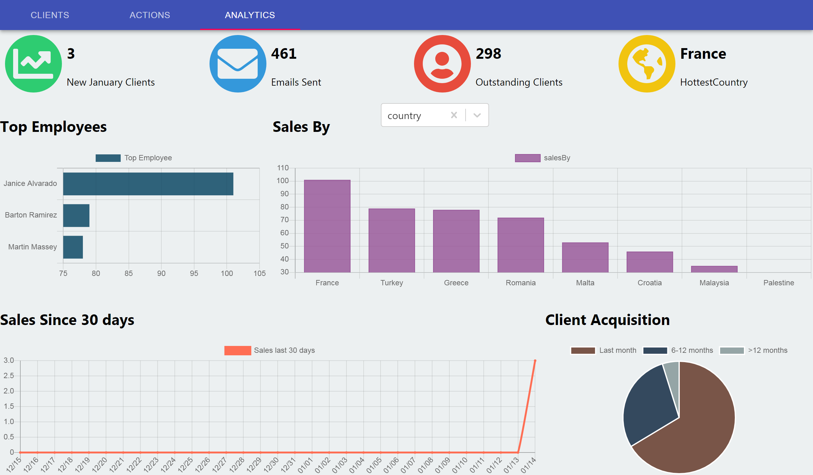
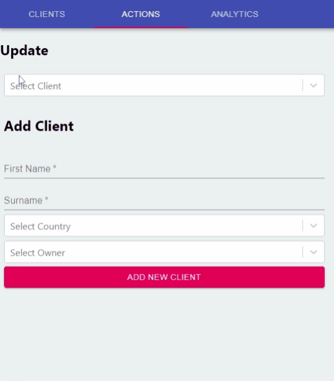
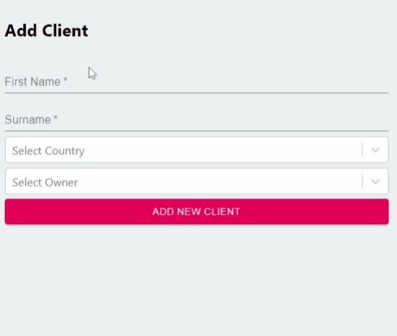
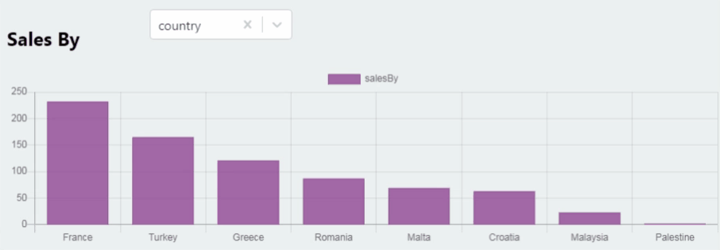

# CRM 🏢

**Customer Relationship Management** tool that allows companies to manage everything to-do with their customers. 🏢👨👩

It is a Full stack Application using React, MySQL, Node, Express and MobX

## 📷 project Screenshots

### Clients Page 👨👩

Show clients in **DataGrid** table with pagination (20 clients per page). The user can **search** clients according to name, country, email, owner and if sold. The user can also **update** client info on click on his/her row. 🔍🔃

### 🔧 Actions (Update & Add Clients) 🔃➕

The user can look for Client and update his/her owner, send email, and declare sale (if the client hasn't been sold before) 

    
    
    
</div

### 📊 Analytics Dashboard 📈📉

This page contain multiple Badges and charts.

## 💻 Technology used

- Client-side: React, MobX, Material-ui, font-awesome, Chartjs
- Server: NodeJS, Express, Sequelize 
- Database: MySQL

## 🔧 Getting Started

- Clone this repository. You will need `node`, `npm` and `MySQL` installed globally on your machine.
- run `npm install` 
- Database setup:
    - run `CREATE DATABASE crmproject` in sql file
    - run `createTable.sql` to create all needed table found in `server/savingToDB` file
    - run `node dataMigration.js` in `server/savingToDB` file
- run `node server.js` in a terminal 
- run `npm start` in another terminal 
